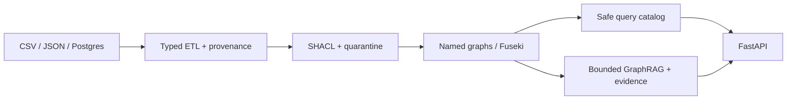

# Enterprise Knowledge Graph

An offline-first portfolio implementation of a governed enterprise knowledge graph: ingest
heterogeneous records, preserve provenance, resolve identities conservatively, publish a
validated graph, and expose bounded evidence-backed queries.

## Architecture



See [architecture](docs/architecture.md), [ontology](docs/ontology.md), and
[integration](docs/integration.md) for boundaries and extension points.

## Quickstart

The baseline needs only Python 3.11–3.13:

```shell
cp .env.example .env
make install
make check
make test
make coverage
```

The full local stack mirrors CI and uses no cloud services:

```shell
make compose-config
docker compose up --build -d
make etl
make compose-tests
curl http://127.0.0.1:8000/health/live
docker compose down -v --remove-orphans
```

ETL and tests are explicit Compose profiles. Details are in the [quickstart](docs/quickstart.md).

## Demonstrated contracts

| Area | Contract |
| --- | --- |
| Safety | Read-only catalog, bounded rows/time, no caller SPARQL execution |
| Governance | SHACL publication gate, quarantine, staged graph promotion |
| Provenance | Source identity, raw hash, run ID, and fixed data-as-of metadata |
| AI boundary | Bounded evidence snapshots and explicit grounding status |
| Delivery | MIT license, offline baseline, 85% branch-coverage gate |

Measured results are kept honest and updated only from executed commands in [results](docs/results.md).
The [test-case matrix](docs/test-cases/enterprise-kg-mvp-coverage-summary.md) maps REQ-01–REQ-33
to reviewable cases.

## Requirement mapping and roadmap

The matrix is the traceability source for requirements, automated references, and expected
outcomes. [Roadmap](docs/roadmap.md) records what remains; Terraform, Kubernetes, cloud
provisioning, and unrestricted SPARQL are intentionally excluded.

## License and limitations

Released under the [MIT License](LICENSE). Fixtures and local Compose defaults are safe
development data, not production credentials. The default graph store and provider seams
are deterministic/offline; external adapters, production auth, operational persistence,
and measured performance results remain explicit integration work.

## Contribution

This project is open for collaboration. If you wish to contribute:

    Fork the repository.
    Create a feature branch (git checkout -b feature/your-feature-name).
    Commit your changes (git commit -m 'Add your feature').
    Push to the branch (git push origin feature/your-feature-name).
    Open a pull request.

## Contact

For any questions or inquiries, please reach out to www.linkedin.com/in/agudatech/.

## Support

If you find this project helpful and would like to support its ongoing development, consider buying me a coffee! Your support helps me keep working on this project and developing more features.

[](https://www.buymeacoffee.com/mauriceague)
