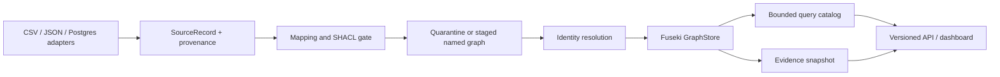

# Architecture

Enterprise KG is an offline-first, bounded pipeline. Source adapters emit typed
`SourceRecord` values; ETL maps and validates them; identity resolution assigns only
explainable links; and staged named-graph publication promotes a complete graph atomically.
The API exposes the query catalog and GraphRAG seams, not arbitrary graph mutation.

## Boundaries

- `kg.ports` owns connector, `GraphStore`, vector, and LLM protocols.
- `kg.etl` owns run manifests, failure closure, replay artifacts, and publication order.
- `kg.query.catalog` is a read-only allowlist with row and timeout caps.
- `kg.graphrag` can answer only from bounded retrieval and reports grounding status.
- `kg.delivery` owns publishability contracts (license, docs, and workflow metadata).
- Observability emits allowlisted JSON events and session-scoped trace records; prompts,
  customer values, URI values, and credentials are not logged.

## Runtime modes

The default test and development path uses deterministic RDFLib fixtures. Compose supplies
Postgres, Fuseki, pgvector, the API, and explicit `etl`/`test` profile jobs for integration
verification. No cloud service is required by the baseline.
